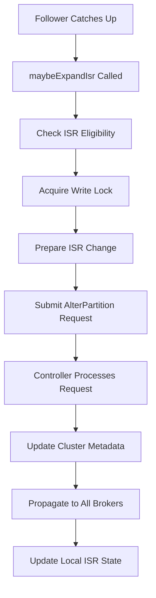

# Kafka Broker Internals: Deep Dive into Request Handling, Replication, and Failure Management

## Table of Contents

1. [Overview](#overview)
2. [Broker Architecture](#broker-architecture)
3. [Request Handling Pipeline](#request-handling-pipeline)
4. [Log Replication Mechanisms](#log-replication-mechanisms)
5. [Failure Detection and Recovery](#failure-detection-and-recovery)
6. [Controller Operations](#controller-operations)
7. [Network Layer](#network-layer)
8. [Performance and Monitoring](#performance-and-monitoring)

## Overview

Apache Kafka is a distributed streaming platform built around a cluster of brokers that handle data replication, request processing, and failure recovery. This document provides a comprehensive analysis of Kafka broker internals, focusing on three critical areas:

- **Request Handling**: How brokers process client and inter-broker requests
- **Log Replication**: How data is replicated across the cluster for durability
- **Failure Management**: How brokers detect, handle, and recover from various failure scenarios

## Broker Architecture

### Core Components

The Kafka broker consists of several key components working together:

```
┌─────────────────────────────────────────────────────────────────┐
│                        Kafka Broker                             │
├─────────────────────────────────────────────────────────────────┤
│  ┌─────────────────┐  ┌─────────────────┐  ┌─────────────────┐ │
│  │   SocketServer  │  │   KafkaApis     │  │ ReplicaManager  │ │
│  │                 │  │                 │  │                 │ │
│  │ • Network I/O   │  │ • Request       │  │ • Partition     │ │
│  │ • Connection    │  │   Processing    │  │   Management    │ │
│  │   Management    │  │ • Protocol      │  │ • Replication   │ │
│  └─────────────────┘  │   Handling      │  │   Coordination  │ │
│                       └─────────────────┘  └─────────────────┘ │
├─────────────────────────────────────────────────────────────────┤
│  ┌─────────────────┐  ┌─────────────────┐  ┌─────────────────┐ │
│  │   LogManager    │  │   Controller    │  │ MetadataCache   │ │
│  │                 │  │   (Optional)    │  │                 │ │
│  │ • Log Storage   │  │ • Cluster       │  │ • Topic/Broker  │ │
│  │ • Segment Mgmt  │  │   Coordination  │  │   Metadata      │ │
│  │ • Cleanup       │  │ • Leader        │  │ • Routing Info  │ │
│  └─────────────────┘  │   Election      │  └─────────────────┘ │
│                       └─────────────────┘                      │
└─────────────────────────────────────────────────────────────────┘
```

### Key Classes and Their Roles

- **KafkaServer**: Main broker entry point, orchestrates all components
- **SocketServer**: Handles network I/O and connection management
- **KafkaApis**: Central request processing hub
- **ReplicaManager**: Manages partition replicas and replication
- **LogManager**: Manages log storage and cleanup
- **KafkaController**: Cluster-wide coordination (one per cluster)

## Request Handling Pipeline

### 1. Network Layer Processing

The request handling begins in the SocketServer component:

```scala
// From SocketServer.scala
class SocketServer(val config: KafkaConfig,
                   val metrics: Metrics,
                   val time: Time,
                   val credentialProvider: CredentialProvider,
                   val apiVersionManager: ApiVersionManager)
```

**Thread Model**:
- **Acceptor Threads**: Handle new connections (1 per listener)
- **Processor Threads**: Read requests from sockets using NIO selectors
- **Handler Threads**: Process requests and generate responses

**Flow**:
1. Acceptor accepts new client connections
2. Processor reads request bytes from socket
3. Request is queued in RequestChannel
4. Handler thread picks up request for processing
5. Response is queued back to Processor for sending

### 2. Request Processing in KafkaApis

The central request processing happens in KafkaApis:

```scala
// From KafkaApis.scala
class KafkaApis(val requestChannel: RequestChannel,
                val metadataSupport: MetadataSupport,
                val replicaManager: ReplicaManager,
                val groupCoordinator: GroupCoordinator,
                val txnCoordinator: TransactionCoordinator,
                // ... other components
)
```

**Key Request Types**:

#### Producer Requests (Produce)
```scala
def handleProduceRequest(request: RequestChannel.Request): Unit = {
  // 1. Validate request and extract record batches
  // 2. Check authorization for each topic
  // 3. Delegate to ReplicaManager for actual log appending
  // 4. Handle callback with response (acks=0,1,all)
}
```

#### Consumer Requests (Fetch)
```scala
def handleFetchRequest(request: RequestChannel.Request): Unit = {
  // 1. Extract fetch parameters (offset, maxBytes, isolation level)
  // 2. Check authorization for each topic-partition
  // 3. Delegate to ReplicaManager for log reading
  // 4. Handle preferred read replicas for followers
  // 5. Return records with watermarks and metadata
}
```

#### Metadata Requests
```scala
def handleMetadataRequest(request: RequestChannel.Request): Unit = {
  // 1. Extract requested topics
  // 2. Check authorization
  // 3. Retrieve cluster metadata from MetadataCache
  // 4. Return broker list, topic-partition leaders, ISR
}
```

### 3. Request Authorization and Validation

Before processing, all requests go through:

1. **Authentication**: Verify client identity
2. **Authorization**: Check ACLs for topic/operation access
3. **Quota Enforcement**: Apply rate limiting if configured
4. **Version Compatibility**: Ensure request version is supported

## Log Replication Mechanisms

### 1. Partition Leadership Model

Kafka uses a leader-follower replication model:

```
Topic: orders, Partition: 0, Replication Factor: 3

┌─────────────────┐    ┌─────────────────┐    ┌─────────────────┐
│    Broker 1     │    │    Broker 2     │    │    Broker 3     │
│    (Leader)     │    │   (Follower)    │    │   (Follower)    │
├─────────────────┤    ├─────────────────┤    ├─────────────────┤
│ Partition 0     │───▶│ Partition 0     │    │ Partition 0     │
│ [Records 1-100] │    │ [Records 1-95]  │    │ [Records 1-90]  │
│                 │    │                 │    │                 │
│ HW: 95          │    │ HW: 95          │    │ HW: 95          │
│ LEO: 100        │    │ LEO: 95         │    │ LEO: 90         │
└─────────────────┘    └─────────────────┘    └─────────────────┘
```

**Key Concepts**:
- **Leader**: Handles all reads/writes for a partition
- **In-Sync Replicas (ISR)**: Replicas that are "caught up" with leader
- **High Watermark (HW)**: Last committed offset (visible to consumers)
- **Log End Offset (LEO)**: Last written offset in the log

### 2. Replication Process

#### Leader-Side Processing

```scala
// In ReplicaManager.scala
def appendRecords(timeout: Long,
                  requiredAcks: Short,
                  internalTopicsAllowed: Boolean,
                  origin: AppendOrigin,
                  entriesPerPartition: Map[TopicPartition, MemoryRecords],
                  responseCallback: Map[TopicPartition, PartitionResponse] => Unit): Unit = {

  // 1. Validate and process records for each partition
  // 2. Append to local log
  // 3. Update producer metadata for exactly-once semantics
  // 4. Wait for required acknowledgments from ISR
  // 5. Invoke callback with results
}
```

#### Follower-Side Replication

Followers use ReplicaFetcherThread to replicate data:

```scala
// In ReplicaFetcherThread.scala
class ReplicaFetcherThread(name: String,
                          leader: LeaderEndpoint,
                          brokerConfig: KafkaConfig,
                          failedPartitions: FailedPartitions,
                          replicaManager: ReplicaManager,
                          quotaManager: ReplicationQuotaManager,
                          logPrefix: String,
                          metadataVersionSupplier: () => MetadataVersion)
  extends AbstractFetcherThread {

  // Continuously fetches data from leader and appends to local log
  override def processPartitionData(topicPartition: TopicPartition,
                                   fetchOffset: Long,
                                   partitionData: FetchData): Unit = {
    // 1. Validate fetched data
    // 2. Check for log truncation needs
    // 3. Append records to local log
    // 4. Update high watermark based on leader's HW
  }
}
```

### 3. Consistency and Acknowledgments

Kafka provides different consistency guarantees based on the `acks` configuration:

- **acks=0**: Fire-and-forget (no acknowledgment)
- **acks=1**: Leader acknowledgment only
- **acks=all/-1**: Full ISR acknowledgment (strongest consistency)

#### ISR Management

```scala
// The leader maintains ISR based on replica lag
def maybeExpandIsr(replicaMaxLagTimeMs: Long): Boolean = {
  // Add replicas to ISR if they're caught up
  // Remove replicas from ISR if they're lagging beyond threshold
}
```

### 4. Log Storage Structure

Each partition is stored as a series of log segments:

```
Partition Log Directory:
├── 00000000000000000000.log         # Segment file (data)
├── 00000000000000000000.index       # Offset index
├── 00000000000000000000.timeindex   # Timestamp index
├── 00000000000000012345.log         # Next segment
├── 00000000000000012345.index
├── 00000000000000012345.timeindex
├── leader-epoch-checkpoint          # Leader epoch history
└── partition.metadata               # Partition metadata
```

**Log Segment Features**:
- **Immutable**: Once written, segments are read-only except for active segment
- **Size-based Rolling**: New segment created when size limit reached
- **Time-based Rolling**: New segment created after time limit
- **Indexed**: Fast offset and timestamp lookups

## Failure Detection and Recovery

### 1. Broker Failure Detection

Kafka uses multiple mechanisms to detect broker failures:

#### Heartbeat Mechanism (KRaft Mode)

```scala
// In BrokerLifecycleManager.scala
class BrokerLifecycleManager(val config: KafkaConfig,
                            val time: Time,
                            val threadNamePrefix: String,
                            val isZkBroker: Boolean,
                            val logDirs: Set[Uuid],
                            val shutdownHook: () => Unit = () => {}) {

  // Sends periodic heartbeats to controller
  def sendBrokerHeartbeat(): Unit = {
    val request = new BrokerHeartbeatRequest.Builder(
      new BrokerHeartbeatRequestData()
        .setBrokerId(nodeId)
        .setBrokerEpoch(brokerEpoch)
        .setCurrentMetadataOffset(highestMetadataOffset)
        .setWantFence(wantFence)
        .setWantShutDown(wantShutdown)
    )
    // Send to controller and handle response
  }
}
```

#### Network-Level Detection

- **Connection Failures**: Detected immediately when socket connection breaks
- **Request Timeouts**: Requests that don't complete within configured timeout
- **Selector Exceptions**: NIO selector errors indicating network issues

### 2. Controller Failover

The controller is critical for cluster coordination. When it fails:

```scala
// In KafkaController.scala
def processControllerChange(): Unit = {
  // 1. Check if this broker should become new controller
  // 2. If yes, initialize controller context
  // 3. Read cluster state from metadata store
  // 4. Trigger leader election for affected partitions
  // 5. Notify all brokers of controller change
}
```

**Controller Election Process**:
1. Broker discovers controller failure
2. Eligible brokers attempt to register as controller
3. First successful registration becomes new controller
4. New controller initializes cluster state
5. Controller sends metadata updates to all brokers

### 3. Partition Leader Failover

When a partition leader fails:

```scala
def electLeader(partitions: Seq[TopicPartition],
                electionType: ElectionType): Unit = {
  partitions.foreach { partition =>
    // 1. Determine new leader from ISR
    // 2. Update partition metadata
    // 3. Send LeaderAndIsr request to all replicas
    // 4. Wait for acknowledgments
    // 5. Update metadata cache
  }
}
```

**Leader Election Strategies**:
- **Preferred Replica Election**: Elect first replica as leader
- **Unclean Election**: Allow out-of-sync replica to become leader (data loss possible)
- **Clean Election**: Only elect from ISR (preserves consistency)

### 4. Replica Recovery

When a broker rejoins the cluster after failure:

```scala
// In ReplicaFetcherThread.scala
def truncateToHighWatermark(): Unit = {
  // 1. Find common epoch with leader
  // 2. Truncate local log to safe point
  // 3. Begin fetching from leader
  // 4. Gradually catch up and rejoin ISR
}
```

**Recovery Steps**:
1. **Log Validation**: Check log integrity on startup
2. **Epoch Verification**: Ensure consistency with leader epoch
3. **Log Truncation**: Remove divergent entries if necessary
4. **Catch-up Replication**: Fetch missing data from leader
5. **ISR Rejoin**: Re-enter ISR once caught up

### 5. Split-Brain Prevention

Kafka prevents split-brain scenarios through:

- **Epoch Numbering**: Each leader has monotonically increasing epoch
- **Fencing**: Old leaders are fenced out with newer epochs
- **Quorum Requirements**: Operations require majority agreement

```scala
// Epoch validation in log append
if (leaderEpoch < localLeaderEpoch) {
  throw new FencedLeaderEpochException(
    s"Leader epoch $leaderEpoch is older than local epoch $localLeaderEpoch")
}
```

## Controller Operations

### 1. Cluster Metadata Management

The controller maintains authoritative cluster state:

```scala
class ControllerContext {
  // Broker metadata
  var liveBrokers: mutable.Set[Broker] = mutable.Set.empty
  var shuttingDownBrokerIds: mutable.Set[Int] = mutable.Set.empty

  // Partition metadata
  val partitionAssignments: mutable.Map[String, mutable.Map[Int, ReplicaAssignment]]
  val partitionLeadershipInfo: mutable.Map[TopicPartition, LeaderAndIsrInfo]

  // State machines
  val replicaStateMachine: ReplicaStateMachine
  val partitionStateMachine: PartitionStateMachine
}
```

### 2. State Machine Management

Controller uses state machines to manage partition and replica states:

#### Replica State Machine

```
NonExistentReplica → NewReplica → OnlineReplica ↔ OfflineReplica
                                       ↓
                               ReplicaDeletionStarted → ReplicaDeletionSuccessful
```

#### Partition State Machine

```
NonExistentPartition → NewPartition → OnlinePartition ↔ OfflinePartition
```

### 3. Administrative Operations

#### Topic Creation

```scala
def createTopics(topicMetadata: Seq[TopicMetadata]): Unit = {
  // 1. Validate topic configurations
  // 2. Assign partitions to brokers
  // 3. Update cluster metadata
  // 4. Trigger partition creation on brokers
  // 5. Send metadata updates to all brokers
}
```

#### Partition Reassignment

```scala
def reassignPartitions(reassignmentMap: Map[TopicPartition, Seq[Int]]): Unit = {
  // 1. Validate new replica assignments
  // 2. Add new replicas to partition
  // 3. Wait for new replicas to catch up
  // 4. Remove old replicas from partition
  // 5. Update partition metadata
}
```

## Network Layer

### 1. Connection Management

The SocketServer manages all network connections:

```scala
// Connection pooling and lifecycle
class ConnectionQuotas(config: KafkaConfig, time: Time, metrics: Metrics) {
  def inc(listenerName: ListenerName, address: InetAddress): Unit = {
    // Track and limit connections per IP/listener
  }

  def dec(listenerName: ListenerName, address: InetAddress): Unit = {
    // Release connection count
  }
}
```

### 2. Request Throttling

Rate limiting prevents resource exhaustion:

```scala
def maybeThrottle(request: RequestChannel.Request,
                 quota: Quota,
                 timeMs: Long): Unit = {
  if (quota.isExceeded) {
    // Apply throttling delay
    val throttleTimeMs = quota.getThrottleTime(timeMs)
    request.requestThrottleTimeMs = throttleTimeMs
  }
}
```

### 3. Protocol Handling

Kafka supports multiple protocol versions:

```scala
// Version-specific request handling
def handleRequest(request: RequestChannel.Request): Unit = {
  request.requestId match {
    case ApiKeys.PRODUCE => handleProduceRequest(request)
    case ApiKeys.FETCH => handleFetchRequest(request)
    case ApiKeys.METADATA => handleMetadataRequest(request)
    // ... other request types
  }
}
```

## Performance and Monitoring

### 1. Key Metrics

**Broker Metrics**:
- `kafka.server:type=BrokerTopicMetrics,name=MessagesInPerSec`
- `kafka.server:type=BrokerTopicMetrics,name=BytesInPerSec`
- `kafka.server:type=BrokerTopicMetrics,name=BytesOutPerSec`
- `kafka.network:type=RequestMetrics,name=TotalTimeMs,request=Produce`

**Replication Metrics**:
- `kafka.server:type=ReplicaManager,name=LeaderCount`
- `kafka.server:type=ReplicaManager,name=PartitionCount`
- `kafka.server:type=ReplicaManager,name=UnderReplicatedPartitions`
- `kafka.server:type=ReplicaManager,name=IsrShrinksPerSec`

### 2. Performance Optimizations

#### Batch Processing
- Producers batch records to reduce network overhead
- Brokers process multiple records in single write operation
- Consumers fetch multiple records in single request

#### Zero-Copy Transfer
- `sendfile()` system call for efficient data transfer
- Direct ByteBuffer usage to avoid memory copying
- Memory-mapped files for log segment access

#### Asynchronous I/O
- NIO selectors for non-blocking network operations
- Separate thread pools for network and request processing
- Pipelining for replica fetching

## Deep Dive: ISR Updates, Log Persistence, Transactions, and Controller Operations

### ISR (In-Sync Replicas) Update Mechanisms

#### ISR Expansion Process

```scala
// From Partition.scala:1022
private def maybeExpandIsr(followerReplica: Replica): Unit = {
  val needsIsrUpdate = !partitionState.isInflight && canAddReplicaToIsr(followerReplica.brokerId) && inReadLock(leaderIsrUpdateLock) {
    needsExpandIsr(followerReplica)
  }
  if (needsIsrUpdate) {
    val alterIsrUpdateOpt = inWriteLock(leaderIsrUpdateLock) {
      partitionState match {
        case currentState: CommittedPartitionState if needsExpandIsr(followerReplica) =>
          Some(prepareIsrExpand(currentState, followerReplica.brokerId))
        case _ => None
      }
    }
    alterIsrUpdateOpt.foreach(submitAlterPartition)
  }
}
```

**Key ISR Expansion Conditions**:
1. **Follower is caught up**: `followerEndOffset >= leaderLog.highWatermark`
2. **Epoch alignment**: `followerEndOffset >= leaderEpochStartOffset`
3. **Replica eligibility**: Not fenced, not in controlled shutdown (KRaft mode)
4. **Broker epoch match**: Fetch request epoch matches cached epoch

#### ISR Shrinking Process

```scala
// From Partition.scala:1243
def maybeShrinkIsr(): Unit = {
  if (needsIsrUpdate) {
    val alterIsrUpdateOpt = inWriteLock(leaderIsrUpdateLock) {
      leaderLogIfLocal.flatMap { leaderLog =>
        val outOfSyncReplicaIds = getOutOfSyncReplicas(replicaLagTimeMaxMs)
        partitionState match {
          case currentState: CommittedPartitionState if outOfSyncReplicaIds.nonEmpty =>
            Some(prepareIsrShrink(currentState, outOfSyncReplicaIds))
          case _ => None
        }
      }
    }
    alterIsrUpdateOpt.foreach(submitAlterPartition)
  }
}
```

**ISR Shrinking Triggers**:
- **Lag-based**: Replicas exceeding `replicaLagTimeMaxMs`
- **Periodic check**: ReplicaManager runs ISR expiration every `replicaLagTimeMaxMs / 2`
- **Connection failures**: Immediate removal on network partitions

#### AlterPartition Request Flow



### Log Persistence and Replication Mechanisms

#### Log Segment Structure and Persistence

```
Partition Log Directory:
├── 00000000000000000000.log         # Data segment
├── 00000000000000000000.index       # Offset → Position index
├── 00000000000000000000.timeindex   # Timestamp → Offset index
├── 00000000000000000000.txnindex    # Transaction index
├── leader-epoch-checkpoint          # Leader epoch boundaries
└── partition.metadata               # Topic ID and other metadata
```

#### Append Process - Leader Side

```scala
// From UnifiedLog.scala
def appendAsLeader(records: MemoryRecords,
                   leaderEpoch: Int,
                   origin: AppendOrigin): LogAppendInfo = {
  val appendInfo = append(records, isFromClient = true, interBrokerProtocolVersion, requestLocal)

  // Update leader epoch cache
  maybeAssignEpochStartOffset(leaderEpoch, appendInfo.firstOffset.map(_.messageOffset).getOrElse(logEndOffset))

  // Trigger high watermark advancement if needed
  updateHighWatermarkMetadata(appendInfo.lastOffset)

  appendInfo
}
```

**Key Steps in Log Append**:
1. **Validation**: Schema validation, offset assignment, timestamp checks
2. **Compression**: Apply broker-side compression if configured
3. **Write to ActiveSegment**: Append to current log segment
4. **Index Updates**: Update offset and timestamp indexes
5. **Producer State**: Update producer epoch and sequence tracking
6. **Replication Trigger**: Notify followers of new data

#### Follower Replication Process

```scala
// From ReplicaFetcherThread.scala
override def processPartitionData(topicPartition: TopicPartition,
                                 fetchOffset: Long,
                                 partitionData: FetchData): Unit = {
  val logAppendInfo = partition.appendRecordsToFollower(partitionData.records, isFuture = false)
  val followerHighWatermark = partitionData.highWatermark
  val leaderLogStartOffset = partitionData.logStartOffset

  // Update high watermark based on leader's HW
  partition.updateFollowerFetchState(
    followerFetchOffsetMetadata = LogOffsetMetadata(logAppendInfo.lastOffset + 1),
    followerStartOffset = followerStartOffset,
    followerHighWatermark = followerHighWatermark,
    leaderLogStartOffset = leaderLogStartOffset
  )
}
```

#### Consistency Guarantees

**High Watermark Protocol**:
- **Leader commits**: HW = min(LEO of all ISR members)
- **Follower visibility**: Only records below HW are visible to consumers
- **Read-your-writes**: Producers can read their own uncommitted writes

**Log Recovery Process**:
1. **Epoch validation**: Check leader epoch on startup
2. **Log truncation**: Remove divergent entries using epoch boundaries
3. **Catch-up replication**: Fetch missing data from leader
4. **ISR re-entry**: Join ISR once caught up within tolerance

### Transaction Implementation Deep Dive

#### Transaction State Machine

```
Empty → Ongoing → PrepareCommit → CompleteCommit
   ↓      ↓           ↓
   → PrepareAbort → CompleteAbort → Dead
```

#### Transaction Coordinator Architecture

```scala
// From TransactionCoordinator.scala
class TransactionCoordinator(txnConfig: TransactionConfig,
                           scheduler: Scheduler,
                           createProducerIdManager: () => ProducerIdManager,
                           txnManager: TransactionStateManager,
                           txnMarkerChannelManager: TransactionMarkerChannelManager,
                           time: Time,
                           logContext: LogContext) {

  // Handles transaction lifecycle operations
  def handleInitProducerId(transactionalId: String, ...): Unit
  def handleAddPartitionsToTransaction(...): Unit
  def handleEndTransaction(...): Unit
}
```

#### Transaction Log Structure

**Transaction Log Topics**:
- **Topic**: `__transaction_state` (50 partitions by default)
- **Replication**: 3x replication factor for durability
- **Partitioning**: `hash(transactionalId) % partitionCount`

**Transaction Log Records**:
```scala
case class TransactionMetadata(
  transactionalId: String,
  producerId: Long,
  producerEpoch: Short,
  txnTimeoutMs: Int,
  state: TransactionState,
  partitions: mutable.Set[TopicPartition],
  txnStartTimestamp: Long,
  txnLastUpdateTimestamp: Long
)
```

#### Two-Phase Commit Protocol

**Phase 1 - Prepare**:
1. Producer calls `commitTransaction()` or `abortTransaction()`
2. Coordinator writes `PrepareCommit`/`PrepareAbort` to transaction log
3. Coordinator sends `WriteTxnMarker` requests to all partition leaders
4. Leaders write transaction markers to their logs

**Phase 2 - Complete**:
1. All partition leaders acknowledge marker writes
2. Coordinator writes `CompleteCommit`/`CompleteAbort` to transaction log
3. Transaction state transitions to final state

#### Transaction Marker Management

```scala
// From TransactionMarkerChannelManager.scala
def addTxnMarkersToSend(coordinatorEpoch: Int,
                       txnResult: TransactionResult,
                       txnMetadata: TransactionMetadata,
                       newMetadata: TxnTransitMetadata): Unit = {

  // Group partitions by broker for efficient batching
  val partitionsByBroker = txnMetadata.partitions.groupBy { partition =>
    metadataCache.getPartitionLeaderEndpoint(partition.topic, partition.partition)
  }

  // Send WriteTxnMarker requests to each broker
  partitionsByBroker.foreach { case (broker, partitions) =>
    sendWriteTxnMarkerRequest(broker, coordinatorEpoch, txnResult, partitions, newMetadata)
  }
}
```

### Controller Operations and Metadata Propagation

#### Controller Election and Initialization

```scala
// From KafkaController.scala:2575
private def processControllerChange(): Unit = {
  val wasActiveController = isActive
  maybeResign()
  zkClient.registerZNodeChangeHandlerAndCheckExistence(ControllerZNode.path, controllerChangeHandler)
  elect()
}

def elect(): Unit = {
  val timestamp = time.milliseconds()
  activeControllerId = zkClient.getControllerId().getOrElse(-1)

  if (activeControllerId != -1) {
    debug("Broker %d has been elected as the controller, so stopping the election process.".format(activeControllerId))
    return
  }

  try {
    // Try to create controller path in ZooKeeper
    val (epoch, epochZkVersion) = zkClient.registerControllerAndIncrementEpoch(config.brokerId)
    controllerContext.epoch = epoch
    controllerContext.epochZkVersion = epochZkVersion
    activeControllerId = config.brokerId

    info(s"Elected controller $config.brokerId with epoch $epoch")
    onControllerFailover()
  } catch {
    case _: ControllerMovedException =>
      // Another broker became controller
      debug("Broker %d was elected as controller instead.".format(zkClient.getControllerId().getOrElse(-1)))
      maybeResign()
  }
}
```

#### Metadata Change Propagation

**Controller → Broker Communication**:

```scala
// From ControllerChannelManager.scala
class ControllerChannelManager extends Logging {
  private val brokerStateInfo = new mutable.HashMap[Int, ControllerBrokerStateInfo]

  def sendRequest(brokerId: Int,
                 request: AbstractControlRequest.Builder[_ <: AbstractControlRequest],
                 callback: AbstractResponse => Unit = null): Unit = {
    brokerStateInfo.get(brokerId) match {
      case Some(stateInfo) =>
        stateInfo.messageQueue.put(QueuedEvent(request, callback))
      case None =>
        warn(s"Not sending request $request to broker $brokerId, since it is offline.")
    }
  }
}
```

#### Key Metadata Update Operations

**1. LeaderAndIsr Updates**:
```scala
def sendLeaderAndIsrRequest(brokers: Seq[Int],
                           partitions: Map[TopicPartition, LeaderAndIsrPartitionState],
                           callback: LeaderAndIsrResponse => Unit): Unit = {
  val leaderAndIsrRequest = new LeaderAndIsrRequest.Builder(
    controllerEpoch,
    brokerEpoch,
    isKRaftController,
    partitions.asJava,
    topicIds.asJava,
    liveBrokers.asJava
  )

  brokers.foreach { brokerId =>
    sendRequest(brokerId, leaderAndIsrRequest, response => callback(response))
  }
}
```

**2. UpdateMetadata Propagation**:
```scala
def sendUpdateMetadataRequest(brokers: Seq[Int],
                             partitions: Map[TopicPartition, UpdateMetadataPartitionState]): Unit = {
  val updateMetadataRequest = new UpdateMetadataRequest.Builder(
    controllerEpoch,
    brokerEpoch,
    isKRaftController,
    partitions.asJava,
    liveBrokers.asJava
  )

  brokers.foreach(sendRequest(_, updateMetadataRequest))
}
```

#### Metadata Cache Updates

**Broker-side Metadata Processing**:
```scala
// From KafkaApis.scala
def handleUpdateMetadataRequest(request: RequestChannel.Request): Unit = {
  val updateMetadataRequest = request.body[UpdateMetadataRequest]

  if (updateMetadataRequest.controllerEpoch < controllerEpoch) {
    stateChangeLogger.warn(s"Ignoring UpdateMetadata due to stale controller epoch")
    return
  }

  // Update local metadata cache
  metadataCache.updateMetadata(
    correlationId = request.header.correlationId,
    updateMetadataRequest = updateMetadataRequest
  )

  // Process partition state changes
  replicaManager.becomeLeaderOrFollower(
    correlationId = request.header.correlationId,
    leaderAndIsrRequest = updateMetadataRequest,
    onLeadershipChange = notifyReplicaStateChange
  )
}
```

#### State Machine Coordination

**Partition State Machine**:
```
NonExistentPartition → NewPartition → OnlinePartition ↔ OfflinePartition
```

**Replica State Machine**:
```
NonExistentReplica → NewReplica → OnlineReplica ↔ OfflineReplica
                                      ↓
                              ReplicaDeletionStarted → ReplicaDeletionSuccessful
```

**Controller Event Processing**:
```scala
class ControllerEventManager(
  controllerId: Int,
  rateAndTimeMetrics: Map[ControllerState, Timer]
) extends Logging {

  private val eventQueue = new LinkedBlockingQueue[ControllerEvent]
  private val processingThread = new ControllerEventThread(ControllerEventThreadName)

  def put(event: ControllerEvent): Unit = {
    eventQueue.put(event)
  }

  private class ControllerEventThread extends ShutdownableThread {
    override def doWork(): Unit = {
      val event = eventQueue.take()
      processEvent(event)
    }
  }
}
```

## Conclusion

Kafka's broker architecture provides a robust foundation for distributed streaming through:

1. **Layered Request Processing**: Clean separation of network, protocol, and business logic
2. **Strong Consistency Model**: Leader-based replication with configurable acknowledgments
3. **Comprehensive Failure Handling**: Multiple detection mechanisms and automated recovery
4. **Horizontal Scalability**: Partition-based distribution across brokers
5. **Performance Optimization**: Batch processing, zero-copy, and asynchronous I/O

**Advanced Features**:
6. **Dynamic ISR Management**: Automatic replica set adjustments based on lag and availability
7. **Transaction Guarantees**: ACID properties through two-phase commit protocol
8. **Controller Coordination**: Centralized cluster state management with automatic failover
9. **Metadata Propagation**: Efficient change notification across all cluster participants

Understanding these internals is crucial for:
- **Operations**: Proper cluster configuration and monitoring
- **Troubleshooting**: Diagnosing performance and consistency issues
- **Capacity Planning**: Sizing clusters for expected load
- **Application Design**: Optimizing producer/consumer configurations

The broker's sophisticated design enables Kafka to handle massive scale while maintaining strong durability and consistency guarantees essential for mission-critical applications.