# Kafka End-to-End Message Flow Deep Dive

This document summarizes Kafka message flow from the producer, consumer, and broker perspectives, based on the source code in this repository. It focuses on batching, network handling, metadata refresh, failover, broker request handling, metadata propagation, partition leader switching, compacted topics, transactions, and ordering guarantees.

## Table of Contents

1. [Important Source Files](#important-source-files)
2. [Producer Publish Flow](#producer-publish-flow)
3. [Producer Batching](#producer-batching)
4. [Producer Metadata Refresh and Failover](#producer-metadata-refresh-and-failover)
5. [Broker Produce API Handling](#broker-produce-api-handling)
6. [Consumer Consume Flow](#consumer-consume-flow)
7. [Consumer Group Coordination](#consumer-group-coordination)
8. [Consumer Fetch and Offset Commit Flow](#consumer-fetch-and-offset-commit-flow)
9. [Broker Request Handling Pipeline](#broker-request-handling-pipeline)
10. [Broker Fetch API Handling](#broker-fetch-api-handling)
11. [KRaft Metadata Propagation](#kraft-metadata-propagation)
12. [Partition Leadership Switching](#partition-leadership-switching)
13. [Replication, ISR, and High Watermark](#replication-isr-and-high-watermark)
14. [ISR Change Flow](#isr-change-flow)
15. [Compacted Topics](#compacted-topics)
16. [Kafka Transactions](#kafka-transactions)
17. [Ordering Guarantees](#ordering-guarantees)
18. [Feature Tradeoff Summary](#feature-tradeoff-summary)
19. [End-to-End Mental Model](#end-to-end-mental-model)

## Important Source Files

### Producer Client

| Area | Source |
| --- | --- |
| Producer public API | `clients/src/main/java/org/apache/kafka/clients/producer/KafkaProducer.java` |
| Producer config | `clients/src/main/java/org/apache/kafka/clients/producer/ProducerConfig.java` |
| Producer metadata | `clients/src/main/java/org/apache/kafka/clients/producer/internals/ProducerMetadata.java` |
| Accumulator and batching | `clients/src/main/java/org/apache/kafka/clients/producer/internals/RecordAccumulator.java` |
| Batch representation | `clients/src/main/java/org/apache/kafka/clients/producer/internals/ProducerBatch.java` |
| Sender thread | `clients/src/main/java/org/apache/kafka/clients/producer/internals/Sender.java` |
| Built-in partitioning | `clients/src/main/java/org/apache/kafka/clients/producer/internals/BuiltInPartitioner.java` |
| Network client | `clients/src/main/java/org/apache/kafka/clients/NetworkClient.java` |
| NIO selector | `clients/src/main/java/org/apache/kafka/common/network/Selector.java` |

### Consumer Client

| Area | Source |
| --- | --- |
| Consumer public API | `clients/src/main/java/org/apache/kafka/clients/consumer/KafkaConsumer.java` |
| Classic consumer implementation | `clients/src/main/java/org/apache/kafka/clients/consumer/internals/ClassicKafkaConsumer.java` |
| Async consumer implementation | `clients/src/main/java/org/apache/kafka/clients/consumer/internals/AsyncKafkaConsumer.java` |
| Consumer delegate creation | `clients/src/main/java/org/apache/kafka/clients/consumer/internals/ConsumerDelegateCreator.java` |
| Group coordinator client | `clients/src/main/java/org/apache/kafka/clients/consumer/internals/ConsumerCoordinator.java` |
| Shared coordinator logic | `clients/src/main/java/org/apache/kafka/clients/consumer/internals/AbstractCoordinator.java` |
| Fetcher | `clients/src/main/java/org/apache/kafka/clients/consumer/internals/Fetcher.java` |
| Shared fetch logic | `clients/src/main/java/org/apache/kafka/clients/consumer/internals/AbstractFetch.java` |
| Fetch collection | `clients/src/main/java/org/apache/kafka/clients/consumer/internals/FetchCollector.java` |
| Completed fetch parsing | `clients/src/main/java/org/apache/kafka/clients/consumer/internals/CompletedFetch.java` |
| Consumer network wrapper | `clients/src/main/java/org/apache/kafka/clients/consumer/internals/ConsumerNetworkClient.java` |

### Broker

| Area | Source |
| --- | --- |
| Network server | `core/src/main/scala/kafka/network/SocketServer.scala` |
| Request/response queue | `core/src/main/scala/kafka/network/RequestChannel.scala` |
| Request handlers | `core/src/main/scala/kafka/server/KafkaRequestHandler.scala` |
| API dispatch | `core/src/main/scala/kafka/server/KafkaApis.scala` |
| Replication manager | `core/src/main/scala/kafka/server/ReplicaManager.scala` |
| Partition state | `core/src/main/scala/kafka/cluster/Partition.scala` |
| Unified log | `core/src/main/scala/kafka/log/UnifiedLog.scala` |
| Replica fetcher | `core/src/main/scala/kafka/server/ReplicaFetcherThread.scala` |
| KRaft metadata cache | `core/src/main/scala/kafka/server/metadata/KRaftMetadataCache.scala` |
| Broker metadata publisher | `core/src/main/scala/kafka/server/metadata/BrokerMetadataPublisher.scala` |
| Metadata cache publisher | `core/src/main/scala/kafka/server/metadata/KRaftMetadataCachePublisher.scala` |
| Broker startup wiring | `core/src/main/scala/kafka/server/BrokerServer.scala` |
| KRaft controller | `metadata/src/main/java/org/apache/kafka/controller/QuorumController.java` |
| Replication control manager | `metadata/src/main/java/org/apache/kafka/controller/ReplicationControlManager.java` |
| Partition change builder | `metadata/src/main/java/org/apache/kafka/controller/PartitionChangeBuilder.java` |

## Producer Publish Flow

At a high level, producer publishing moves through:

```text
KafkaProducer.send
  -> interceptors
  -> metadata wait/update
  -> serialization
  -> partition selection
  -> RecordAccumulator append
  -> Sender thread drain
  -> ProduceRequest
  -> NetworkClient/Selector
  -> broker append
  -> ProduceResponse
  -> retry or complete callback/future
```

### Producer End-to-End Diagram

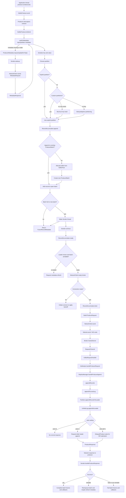

### Producer Thread Model

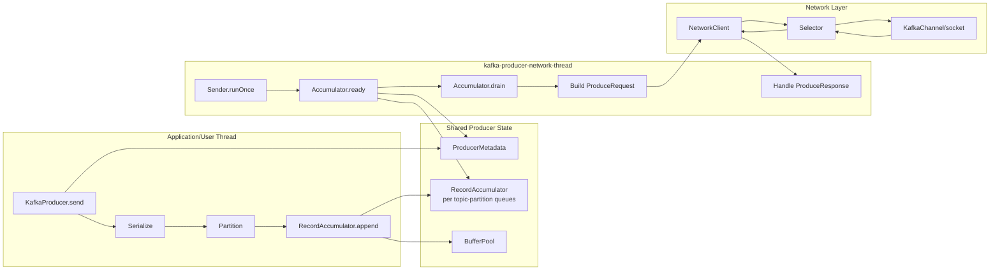

### Key Producer Methods

| Step | Method |
| --- | --- |
| Public send | `KafkaProducer.send(ProducerRecord<K, V>, Callback)` |
| Main implementation | `KafkaProducer.doSend(...)` |
| Metadata wait | `KafkaProducer.waitOnMetadata(...)` |
| Partition selection | `KafkaProducer.partition(...)` |
| Append to accumulator | `RecordAccumulator.append(...)` |
| Sender loop | `Sender.runOnce()` |
| Ready check | `RecordAccumulator.ready(...)` |
| Drain batches | `RecordAccumulator.drain(...)` |
| Build/send produce requests | `Sender.sendProduceRequests(...)`, `Sender.sendProduceRequest(...)` |
| Handle response | `Sender.handleProduceResponse(...)`, `Sender.completeBatch(...)` |
| Network send | `NetworkClient.send(...)` |
| Socket I/O | `Selector.poll(...)` |

## Producer Batching

Kafka producer batching is mainly managed by `RecordAccumulator`.

Records are grouped by topic-partition:

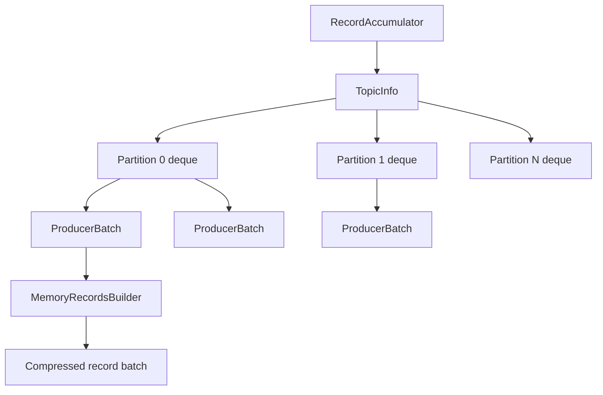

### Append Path

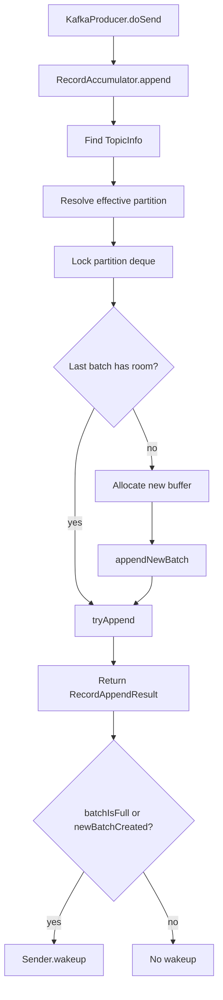

### When a Batch Becomes Sendable

`RecordAccumulator.ready(...)` considers a partition sendable when at least one of these is true:

| Trigger | Description |
| --- | --- |
| Batch full | The batch reached configured `batch.size` or record builder capacity |
| Linger expired | `linger.ms` elapsed for the oldest batch |
| Buffer exhausted | Producer memory pressure forces progress |
| Flush in progress | User called `flush()` |
| Transaction completing | Transaction manager requires draining |
| Producer closing | Sender must complete or fail remaining batches |

### Important Batching Details

- A batch is per topic-partition.
- Compression is applied at the record batch level.
- Larger batches improve throughput but can increase latency.
- `linger.ms` intentionally delays sending to allow more records to join the same batch.
- Unkeyed records use sticky/adaptive partitioning to improve batching efficiency.
- Idempotent producers can mute partitions to preserve per-partition sequence ordering.

## Producer Metadata Refresh and Failover

Producer metadata includes broker ids, broker endpoints, topic partitions, leaders, and leader epochs.

### Metadata Refresh Diagram

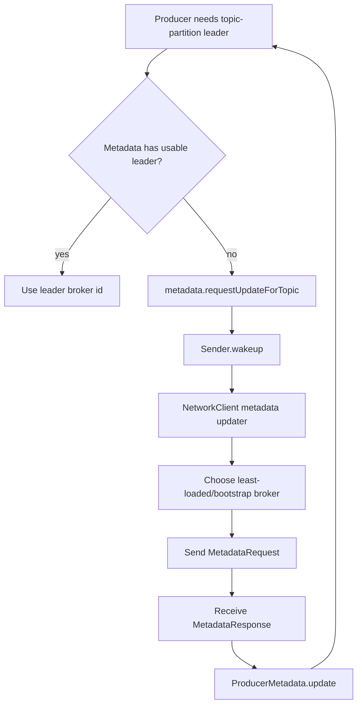

### Produce Retry and Failover Diagram

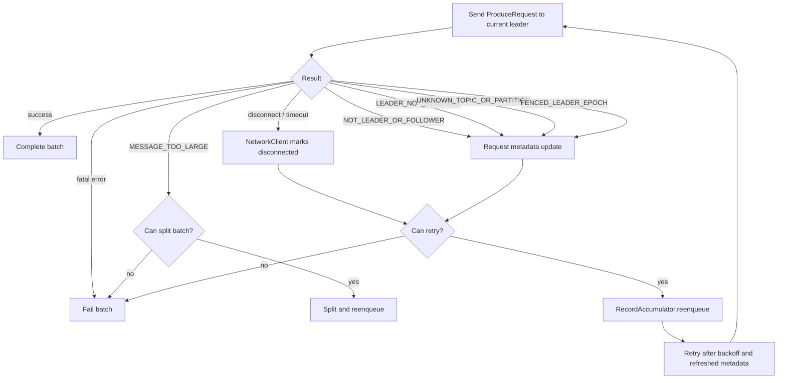

### Retry Boundaries

`Sender.canRetry(...)` requires:

- The batch has not exceeded `delivery.timeout.ms`.
- The attempt count is within `retries`.
- The batch has not already completed.
- The error is retriable, or the transaction manager allows the retry.
- Idempotence/transactions can add stricter ordering and fencing constraints.

### Network Connection Handling

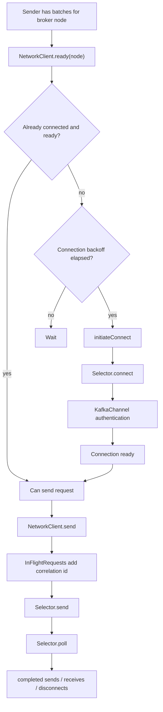

## Broker Produce API Handling

The broker receives a `ProduceRequest` through the network layer and dispatches it through `KafkaApis`.

### Produce Request Sequence

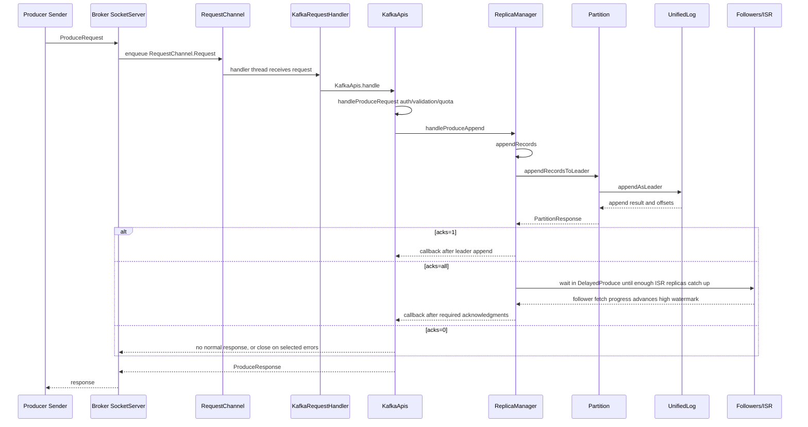

### Broker Produce Steps

| Step | Code Area | Responsibility |
| --- | --- | --- |
| Parse request | `SocketServer`, `RequestChannel` | Read bytes, create request object, enqueue |
| Dispatch | `KafkaRequestHandler`, `KafkaApis.handle` | Route by API key |
| Validate | `KafkaApis.handleProduceRequest` | Auth, topic existence, record validation, quotas |
| Append | `ReplicaManager.handleProduceAppend` | Transaction verification, append orchestration |
| Local log write | `Partition.appendRecordsToLeader`, `UnifiedLog.appendAsLeader` | Assign offsets, append records, update log state |
| Ack handling | `ReplicaManager.appendRecords`, delayed produce purgatory | Immediate response or wait for ISR |
| Response | `KafkaApis` and `RequestChannel` | Send `ProduceResponse` or no-op for `acks=0` |

## Consumer Consume Flow

At a high level, consumer polling moves through:

```text
KafkaConsumer.poll
  -> delegate poll
  -> group coordination / assignment update
  -> position validation
  -> fetch request preparation
  -> ConsumerNetworkClient / NetworkClient
  -> broker fetch
  -> FetchResponse
  -> CompletedFetch buffer
  -> deserialization
  -> ConsumerRecords returned
```

### Classic Consumer Poll Diagram

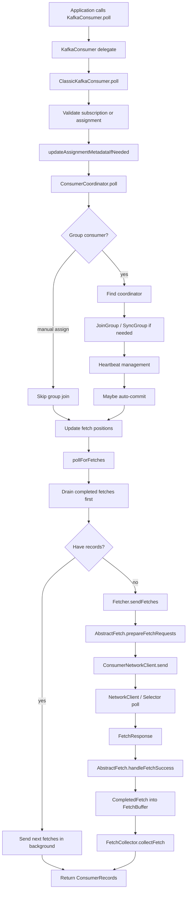

### Classic vs Async Consumer

| Mode | Entry | Network behavior |
| --- | --- | --- |
| Classic protocol | `ClassicKafkaConsumer.poll(...)` | Application thread drives coordinator and network polling through `ConsumerNetworkClient` |
| New consumer protocol | `AsyncKafkaConsumer.poll(...)` | Application thread exchanges events with `ConsumerNetworkThread`; background thread owns request managers and network polling |

The delegate is selected in `ConsumerDelegateCreator` based on `group.protocol`.

## Consumer Group Coordination

### Join and Sync Diagram

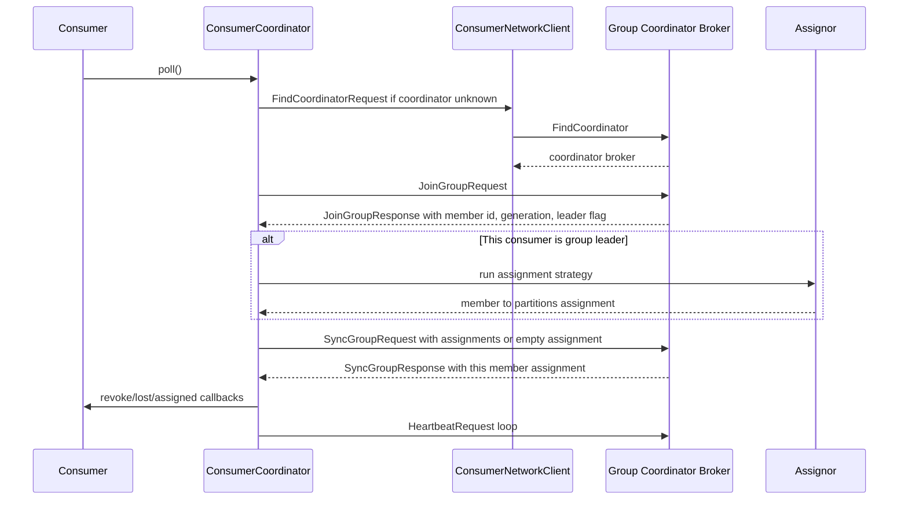

### Group Coordination Details

- The consumer group coordinator is the broker that leads the relevant `__consumer_offsets` partition for the group id.
- `FindCoordinatorRequest` discovers that broker.
- `JoinGroupRequest` registers membership and elects a group leader for assignment.
- The group leader runs the configured assignor.
- `SyncGroupRequest` distributes final assignments.
- Heartbeats keep the member alive.
- Rebalance can be triggered by member changes, subscription changes, heartbeat/session timeouts, metadata changes, or assignment strategy changes.

### Eager vs Cooperative Rebalance

| Rebalance style | Behavior |
| --- | --- |
| Eager | Revoke all assigned partitions, rejoin, then assign again |
| Cooperative | Revoke only partitions that must move; unaffected partitions can continue being consumed |

## Consumer Fetch and Offset Commit Flow

### Fetch Request Construction

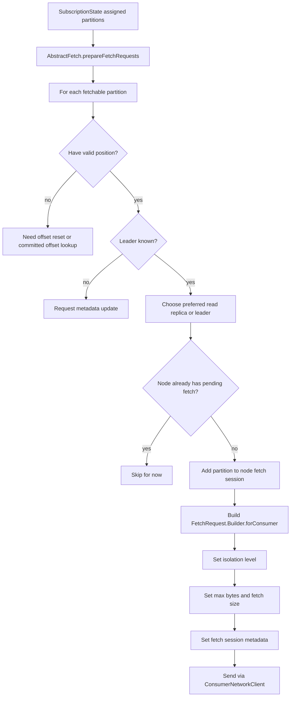

### Fetch Response Collection

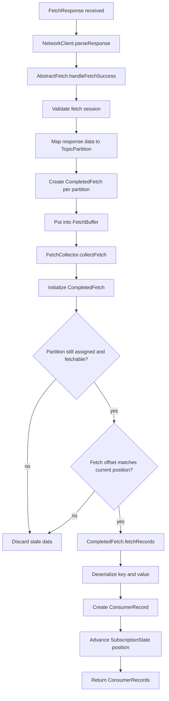

### Offset Commit Flow

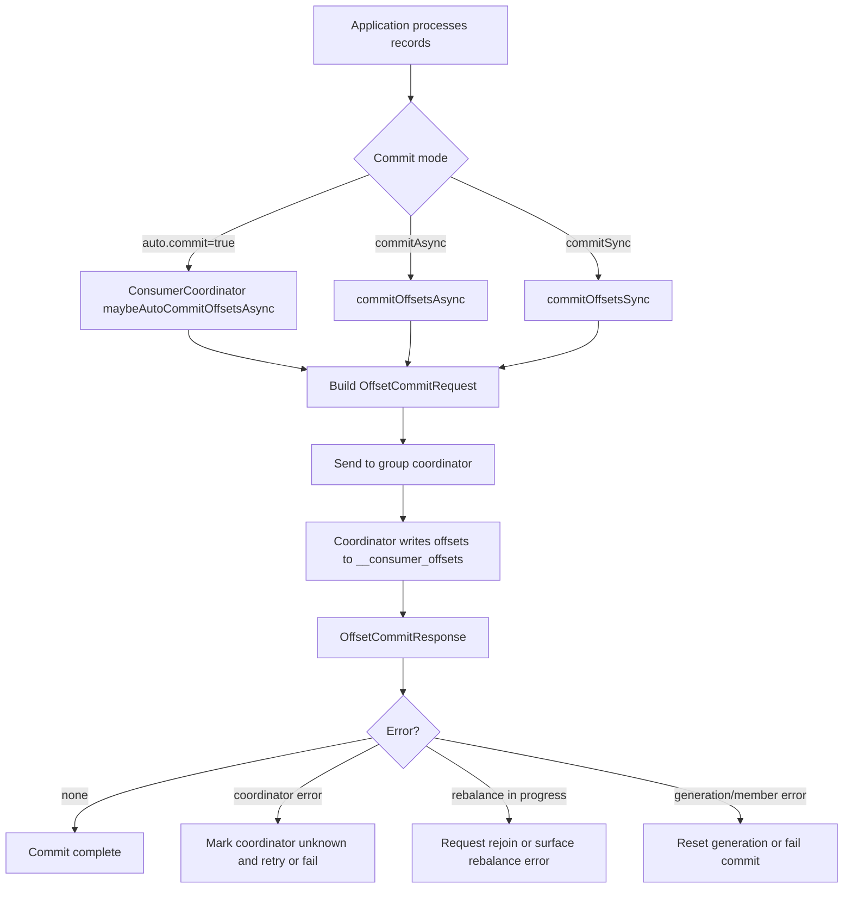

### Important Consumer Methods

| Step | Method |
| --- | --- |
| Public poll | `KafkaConsumer.poll(Duration)` |
| Classic poll | `ClassicKafkaConsumer.poll(Duration)` |
| Assignment/group update | `ClassicKafkaConsumer.updateAssignmentMetadataIfNeeded(...)` |
| Coordinator poll | `ConsumerCoordinator.poll(...)` |
| Join group | `AbstractCoordinator.ensureActiveGroup(...)`, `joinGroupIfNeeded(...)` |
| Fetch polling | `ClassicKafkaConsumer.pollForFetches(...)` |
| Send fetches | `Fetcher.sendFetches()` |
| Build fetch requests | `AbstractFetch.prepareFetchRequests()` |
| Handle fetch response | `AbstractFetch.handleFetchSuccess(...)` |
| Collect records | `FetchCollector.collectFetch(...)` |
| Parse records | `CompletedFetch.fetchRecords(...)`, `parseRecord(...)` |
| Sync commit | `ConsumerCoordinator.commitOffsetsSync(...)` |
| Async commit | `ConsumerCoordinator.commitOffsetsAsync(...)` |

## Broker Request Handling Pipeline

### Request Pipeline Diagram

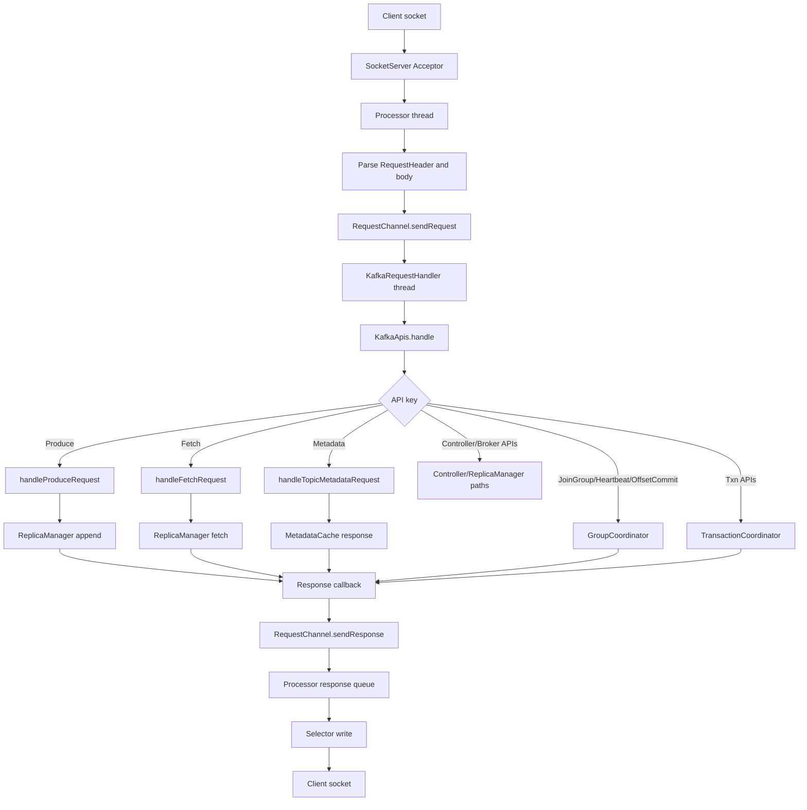

### Broker Thread Model

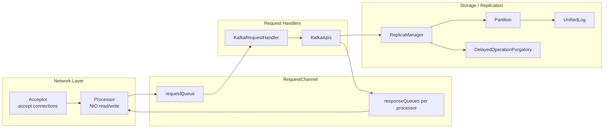

### Main Broker Request Components

| Component | Role |
| --- | --- |
| `SocketServer` | Owns acceptors and processors for broker listeners |
| `Processor` | Reads requests and writes responses using NIO |
| `RequestChannel` | Bridges network processors and request handler threads |
| `KafkaRequestHandler` | Pulls requests from the queue and invokes `KafkaApis` |
| `KafkaApis` | Central API-key dispatcher and protocol-level logic |
| `ReplicaManager` | Handles partition append/fetch, leader/follower transitions, delayed operations |
| `Partition` | Owns local partition state, ISR state, leader/follower behavior |
| `UnifiedLog` | Local durable log abstraction |

## Broker Fetch API Handling

### Fetch Request Sequence

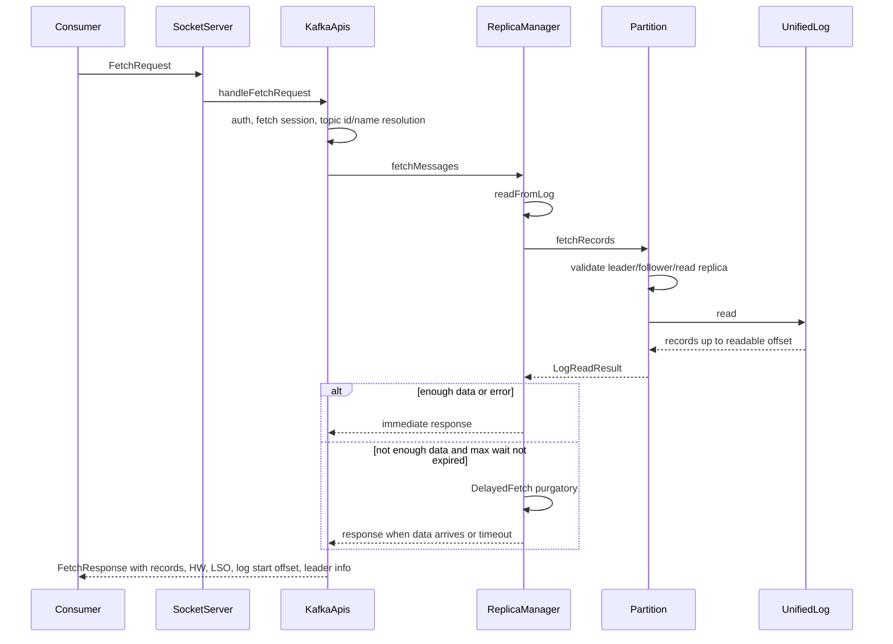

### Fetch Read Visibility

| Fetch type | Readable offset boundary |
| --- | --- |
| Follower replication fetch | Log end offset, because followers need all leader data |
| Normal consumer fetch | High watermark, because consumers should see committed data |
| `read_committed` consumer fetch | Last stable offset, because open transactions must be hidden |

### Delayed Fetch

If a fetch request does not yet have enough data to satisfy `min.bytes`, the broker can park it in delayed operation purgatory until:

- Enough bytes arrive.
- The fetch max wait expires.
- An error or metadata change requires completing the request.
- New data advances a watched partition and triggers completion.

## KRaft Metadata Propagation

In KRaft mode, committed metadata records are loaded into immutable metadata images. Broker components consume these images rather than reading cluster state directly from ZooKeeper.

### Metadata Propagation Diagram

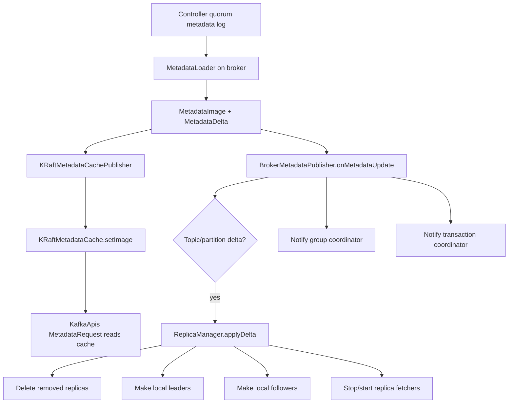

### Important Metadata Components

| Component | Responsibility |
| --- | --- |
| `QuorumController` | Active KRaft controller; writes metadata changes into the metadata log |
| `MetadataLoader` | Loads committed metadata records and builds image/delta updates |
| `MetadataImage` | Immutable point-in-time view of cluster metadata |
| `KRaftMetadataCache` | Broker-local metadata cache read by request handling |
| `BrokerMetadataPublisher` | Applies metadata deltas to broker runtime components |
| `ReplicaManager.applyDelta` | Converts metadata topic deltas into local replica state changes |

## Partition Leadership Switching

Leadership changes are controller-driven and propagated through metadata records.

### Leader Election and Broker Application

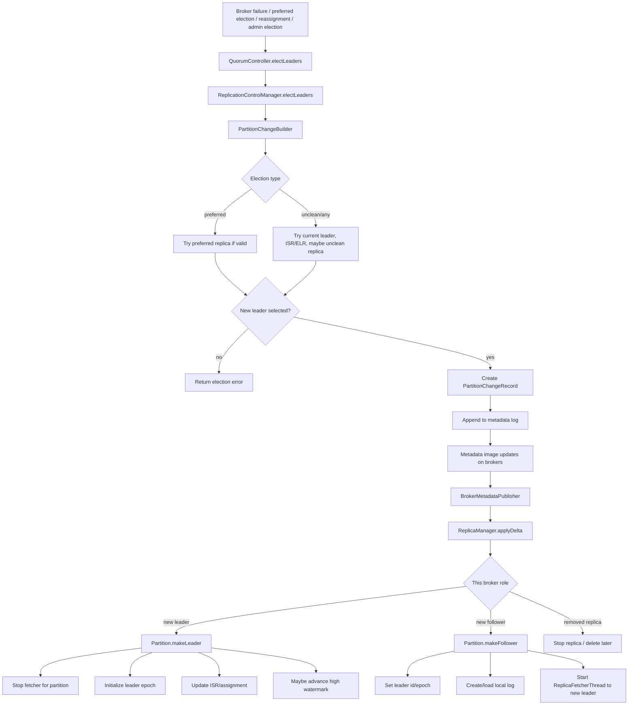

### Clean vs Unclean Election

| Election type | Behavior | Risk |
| --- | --- | --- |
| Clean election | Selects an in-sync or otherwise eligible replica | Preserves committed data |
| Preferred leader election | Moves leadership to preferred replica if valid | Low risk if preferred replica is eligible |
| Unclean election | Selects a replica outside the safe ISR path when allowed | Can lose acknowledged data |

### Broker-Side Role Change

When metadata says a local replica changed role:

- `ReplicaManager.applyDelta(...)` computes local changes.
- New leaders go through `Partition.makeLeader(...)`.
- New followers go through `Partition.makeFollower(...)`.
- Fetchers are stopped for partitions that became leaders.
- Fetchers are started or redirected for partitions that became followers.
- Leader epochs are updated so clients and replicas can detect stale leadership.

## Replication, ISR, and High Watermark

### Replication Flow

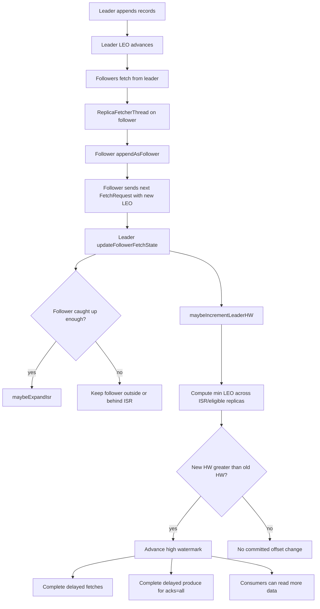

### ISR Shrink and Failover

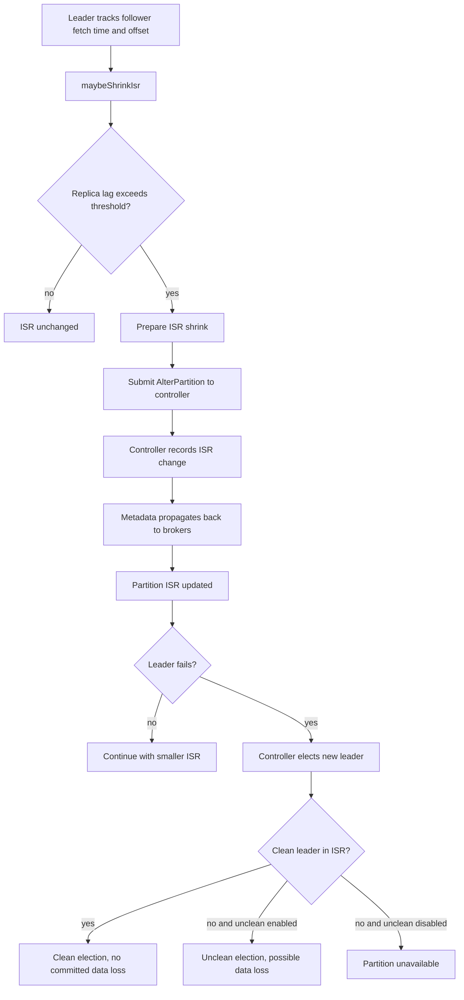

### Key Replication Terms

| Term | Meaning |
| --- | --- |
| LEO | Log end offset; next offset after the last local log record |
| HW | High watermark; highest offset considered committed and visible to normal consumers |
| LSO | Last stable offset; highest offset visible to `read_committed` consumers |
| ISR | In-sync replica set; replicas eligible for clean committed-data-preserving leadership |
| Leader epoch | Monotonic epoch for partition leadership changes |
| DelayedProduce | Broker delayed operation for `acks=all` produce requests |
| DelayedFetch | Broker delayed operation for fetch requests waiting for enough data |

## ISR Change Flow

ISR changes are driven by the current partition leader and committed through the controller. The leader detects follower progress or lag, proposes a new ISR through `AlterPartition`, waits for the controller response, then moves the local partition state from pending to committed. KRaft metadata propagation later brings every broker's metadata image into the same state.

### ISR Change Source Anchors

| Flow | Source |
| --- | --- |
| Periodic ISR shrink scheduling | `core/src/main/scala/kafka/server/ReplicaManager.scala` |
| Per-partition shrink scan | `ReplicaManager.maybeShrinkIsr()`, `Partition.maybeShrinkIsr()` |
| Follower progress tracking | `Partition.updateFollowerFetchState(...)` |
| ISR expansion decision | `Partition.maybeExpandIsr(...)`, `isFollowerInSync(...)` |
| ISR shrink decision | `Partition.getOutOfSyncReplicas(...)` |
| Pending ISR state creation | `Partition.prepareIsrExpand(...)`, `prepareIsrShrink(...)` |
| Controller submission | `Partition.submitAlterPartition(...)` |
| Broker-side request batching | `AlterPartitionManager.submit(...)`, `maybePropagateIsrChanges()` |
| Controller response handling | `AlterPartitionManager.handleAlterPartitionResponse(...)` |
| Local committed state update | `Partition.handleAlterPartitionUpdate(...)` |

### ISR Expansion Flow

A follower is added back to ISR after the leader observes it has caught up far enough. In this codebase, `Partition.isFollowerInSync(...)` requires the follower LEO to be at least the leader high watermark and at least the current leader epoch start offset. In KRaft mode, `isReplicaIsrEligible(...)` also checks broker liveness/fencing/shutdown and broker epoch consistency.

```mermaid
flowchart TD
    A[Follower sends FetchRequest to leader] --> B[Leader updates follower fetch state]
    B --> C[Replica LEO and fetch time recorded]
    C --> D[maybeExpandIsr]

    D --> E{ISR update already in flight?}
    E -->|yes| F[Do not propose another update yet]
    E -->|no| G{Replica eligible for ISR?}

    G -->|no| H[Keep follower outside ISR]
    G -->|yes| I{Follower in sync with leader?}
    I -->|no| H
    I -->|yes| J[prepareIsrExpand]

    J --> K[Set PendingExpandIsr locally]
    K --> L[submitAlterPartition]
    L --> M[AlterPartitionManager queues update]
    M --> N[Send AlterPartitionRequest to controller]
    N --> O[Controller validates and records ISR]
    O --> P[AlterPartitionResponse]
    P --> Q[handleAlterPartitionUpdate]
    Q --> R[CommittedPartitionState with expanded ISR]
    R --> S[maybeIncrementLeaderHW]
    S --> T[Complete delayed fetch and produce operations]
```

Important expansion details:

- Expansion is triggered on follower fetch progress in `Partition.updateFollowerFetchState(...)`.
- The leader first records the follower's fetch offset, start offset, fetch time, leader end offset, and broker epoch.
- The leader does not add a follower to ISR only because it exists; the follower must be eligible and caught up.
- `prepareIsrExpand(...)` uses a pending expanded ISR before controller confirmation. This is conservative for high watermark advancement because the expanded ISR can only make the high watermark requirement stricter.
- After controller success, `handleAlterPartitionUpdate(...)` commits the new ISR and may advance the high watermark.

### ISR Shrink Flow

ISR shrink is periodic. `ReplicaManager.startup()` schedules the `"isr-expiration"` task at `replica.lag.time.max.ms / 2`. That task scans online partitions and calls `Partition.maybeShrinkIsr()`.

```mermaid
flowchart TD
    A[ReplicaManager startup] --> B[Schedule isr-expiration task]
    B --> C[ReplicaManager.maybeShrinkIsr scans online partitions]
    C --> D[Partition.maybeShrinkIsr]
    D --> E{ISR update already in flight?}
    E -->|yes| F[Skip this round]
    E -->|no| G[getOutOfSyncReplicas]

    G --> H{Any ISR follower out of sync?}
    H -->|no| I[ISR unchanged]
    H -->|yes| J[prepareIsrShrink]

    J --> K[Set PendingShrinkIsr locally]
    K --> L[submitAlterPartition]
    L --> M[AlterPartitionManager queues update]
    M --> N[Send AlterPartitionRequest to controller]
    N --> O[Controller validates and records ISR]
    O --> P[AlterPartitionResponse]
    P --> Q[handleAlterPartitionUpdate]
    Q --> R[CommittedPartitionState with shrunken ISR]
    R --> S{Partition under min ISR?}
    S -->|yes| T[acks=all produce may fail or stop advancing]
    S -->|no| U[Continue normal produce and fetch]
```

A follower is considered out of sync when it is stuck or slow relative to `replica.lag.time.max.ms`. The implementation uses `lastCaughtUpTimeMs`, not only instantaneous LEO, so a replica that has not caught up to the leader's LEO within the allowed lag window is removed from ISR.

Unlike expansion, `prepareIsrShrink(...)` cannot assume the controller update will succeed. Its pending state keeps the current ISR as the maximal ISR so the leader does not accidentally advance the high watermark based on an uncommitted shrink.

### AlterPartition Commit Flow

Both expansion and shrink converge on the same `AlterPartition` path.

```mermaid
sequenceDiagram
    participant L as Leader Broker
    participant P as Partition
    participant A as AlterPartitionManager
    participant C as Controller
    participant M as Metadata Log
    participant B as Brokers

    L->>P: Detect ISR expand or shrink
    P->>P: Build pending ISR state
    P->>A: submit new LeaderAndIsr
    A->>A: Put in unsentIsrUpdates
    A->>C: AlterPartitionRequest
    C->>M: Commit partition ISR update
    C-->>A: AlterPartitionResponse
    A-->>P: Complete future with LeaderAndIsr
    P->>P: handleAlterPartitionUpdate
    P->>P: Move pending state to committed state
    P->>P: Maybe increment high watermark
    M-->>B: Metadata image update
    B->>B: ReplicaManager.applyDelta
```

Important commit details:

- `AlterPartitionManager.submit(...)` stores one unsent update per topic-partition and rejects a duplicate enqueue while one is already pending.
- `maybePropagateIsrChanges()` sends pending updates only when no `AlterPartition` request is already in flight.
- Top-level controller errors are retried by scheduling another propagation attempt.
- Partition-level success completes the future with the controller's `LeaderAndIsr`.
- `Partition.submitAlterPartition(...)` ignores stale responses if local partition state changed before the controller response arrived.
- `handleAlterPartitionUpdate(...)` rejects stale leader epochs or stale partition epochs, commits the returned ISR, updates the partition epoch, notifies listeners, and may advance high watermark.

### ISR Change Impact on Produce and Consume

```mermaid
flowchart TD
    A[ISR changes committed] --> B{ISR expanded or shrunk?}

    B -->|expanded| C[More replicas participate in committed quorum]
    C --> D[High watermark waits for larger eligible set]
    D --> E[acks=all durability strengthens]

    B -->|shrunk| F[Fewer replicas remain in committed quorum]
    F --> G{ISR size below min.insync.replicas?}
    G -->|yes| H[Leader is under min ISR]
    H --> I[acks=all produce can fail]
    H --> J[High watermark will not advance in maybeIncrementLeaderHW]

    G -->|no| K[Leader can continue accepting quorum writes]
    K --> L[High watermark based on remaining ISR]

    D --> M[Consumers see data only after HW or LSO permits]
    J --> M
    L --> M
```

Operationally, ISR is the bridge between producer durability and consumer visibility:

- Producers using `acks=all` depend on ISR membership and `min.insync.replicas`.
- Consumers do not read uncommitted leader-only data; normal consumers are bounded by high watermark, and `read_committed` consumers are bounded by last stable offset.
- A shrinking ISR can keep the partition available but reduce fault tolerance.
- Falling below `min.insync.replicas` protects durability by preventing successful quorum writes until ISR recovers.
- An expanding ISR can temporarily make high watermark advancement stricter, but it improves future failover safety.

## Compacted Topics

Compacted topics solve the problem of keeping a durable, replayable latest-state log without retaining every historical update forever. They are essential for changelog topics, metadata-like streams, caches, tables, and keyed state replication.

### Critical Problem Solved

Normal delete-based retention answers: "How much history should I keep by time or size?" Compaction answers a different question: "For every key, what is the latest known value?" Without compaction, a topic used as a table changelog grows forever even if every new record supersedes an older value for the same key.

Kafka solves this by preserving the append-only log abstraction while asynchronously removing obsolete key versions from old segments. Consumers can still replay the compacted log to rebuild the latest table state, and offsets are not renumbered.

### Source Anchors

| Area | Source |
| --- | --- |
| Topic cleanup policy config | `storage/src/main/java/org/apache/kafka/storage/internals/log/LogConfig.java` |
| Public topic config docs | `clients/src/main/java/org/apache/kafka/common/config/TopicConfig.java` |
| Key validation for compacted topics | `storage/src/main/java/org/apache/kafka/storage/internals/log/LogValidator.java` |
| Cleaner startup | `core/src/main/scala/kafka/log/LogManager.scala`, `LogCleaner.scala` |
| Cleaner scheduling and eligibility | `core/src/main/scala/kafka/log/LogCleanerManager.scala` |
| Cleaner implementation | `core/src/main/scala/kafka/log/LogCleaner.scala` |
| Record filtering / tombstone horizon | `clients/src/main/java/org/apache/kafka/common/record/MemoryRecords.java` |
| Segment deletion interaction | `core/src/main/scala/kafka/log/UnifiedLog.scala` |

### How Compaction Works

```mermaid
flowchart TD
    A["Topic has cleanup.policy=compact"] --> B[Producers append keyed records]
    B --> C[UnifiedLog stores immutable segments]
    C --> D[Active segment remains uncleanable]
    C --> E[Older dirty segments become candidates]

    E --> F[LogCleanerManager computes cleanable ratio]
    F --> G{Eligible for cleaning?}
    G -->|no| H[Cleaner backs off]
    G -->|yes| I[CleanerThread grabs filthiest log]

    I --> J[Build offset map]
    J --> K["key -> latest offset"]
    K --> L[Re-copy old segments]
    L --> M{Record retained?}

    M -->|latest value for key| N[Copy record]
    M -->|old value for key| O[Drop record]
    M -->|tombstone before delete horizon| N
    M -->|expired tombstone| O

    N --> P[Write replacement cleaned segment]
    O --> P
    P --> Q[Flush and swap cleaned segments]
    Q --> R[Checkpoint clean offset]
```

### Cleaner Eligibility

The cleaner does not rewrite every segment immediately. It chooses compacted logs when:

- `cleanup.policy` includes `compact`.
- The log is not already being cleaned.
- The active segment is excluded.
- The cleanable range is below the first uncleanable offset, which is constrained by active segment, last stable offset, and `min.compaction.lag.ms`.
- `cleanableRatio > min.cleanable.dirty.ratio`, or `max.compaction.lag.ms` forces eligibility.

This design prevents compaction from racing active writes and avoids rewriting logs too aggressively.

### Key-Based Dedupe and Tombstones

```mermaid
flowchart LR
    A["k1:v1 offset 10"] --> B["k2:v1 offset 11"]
    B --> C["k1:v2 offset 12"]
    C --> D["k1:null offset 20"]
    D --> E[Cleaner offset map]

    E --> F["k1 -> 20"]
    E --> G["k2 -> 11"]

    F --> H[Drop older k1 values]
    G --> I[Keep latest k2 value]
    F --> J{Tombstone retention expired?}
    J -->|no| K[Keep delete marker]
    J -->|yes| L[Drop delete marker]
```

Important behavior:

- Compacted topics require keys. Records without keys are invalid for compacted topics.
- A `null` value is a tombstone. It means "delete this key."
- Tombstones are retained for `delete.retention.ms` so consumers replaying from the beginning can observe deletes.
- After the delete horizon passes, the cleaner can remove the tombstone too.
- Compaction preserves original offsets. Consumers may see offset gaps after compaction.

### Compact Plus Delete

`cleanup.policy=compact,delete` enables both policies:

- Compaction removes obsolete key versions from retained segments.
- Delete retention can still remove whole old segments by time or size.
- The cleaner coordinates with segment deletion to avoid compaction/deletion races.

This is useful when the topic should retain recent full history but only latest-key state for older data.

### Biggest Challenges in Using Compacted Topics

| Challenge | Why it matters |
| --- | --- |
| Choosing correct keys | Compaction is only as correct as the key model. Wrong keys create wrong latest-state semantics. |
| Tombstone handling | Consumers must understand `null` values as deletes, not ordinary empty values. |
| Snapshot rebuild window | Consumers rebuilding from offset 0 must read tombstones before `delete.retention.ms` expires. |
| Offset gaps | Applications must not assume offsets are contiguous after compaction. |
| Delayed cleanup | Compaction is asynchronous; old values may remain for a while. |
| Cleaner resource pressure | Large compacted topics need cleaner threads, I/O buffers, and throttling tuned carefully. |
| `compact,delete` semantics | Operators must understand that delete retention can still remove old segments entirely. |

### Implementation Best Practices Used by Kafka

- **Asynchronous background cleaning:** Producers and consumers are not blocked by compaction.
- **Segment-level copy-and-swap:** Cleaner writes replacement segments and swaps them in, avoiding in-place mutation.
- **Offset preservation:** Kafka maintains stable offsets even when records are removed.
- **Checkpointing:** Cleaner checkpoints progress so it can resume efficiently after restart.
- **Conservative eligibility:** Active segments, unstable transaction ranges, and min compaction lag are protected.
- **Explicit tombstone lifecycle:** Delete markers are retained long enough for state rebuilds, then removed.
- **Config-driven behavior:** Operators can tune dirty ratio, lag, delete retention, cleaner threads, and I/O throttling.

## Kafka Transactions

Kafka transactions solve atomic, exactly-once processing across multiple topic partitions and consumer offset commits. They combine idempotent producer sequencing, transactional coordinator state, transaction markers, and `read_committed` fetch isolation.

### Critical Problem Solved

Without transactions, a stream processor can produce output records and commit consumed offsets independently. A crash between those operations can create duplicates, lost processing progress, or externally visible partial results. Transactions solve this by making produced records and consumed-offset commits part of one atomic unit.

Kafka solves this with:

- A transactional id mapped to a producer id and epoch.
- A transaction coordinator that persists transaction state in `__transaction_state`.
- Per-partition transaction membership tracked through `AddPartitionsToTxn`.
- End transaction markers written to data partitions.
- `read_committed` consumers that stop at the last stable offset and skip aborted records.
- Epoch fencing to prevent zombie producers and stale coordinators from committing old work.

### Source Anchors

| Area | Source |
| --- | --- |
| Public transaction APIs | `clients/src/main/java/org/apache/kafka/clients/producer/KafkaProducer.java` |
| Client transaction state machine | `clients/src/main/java/org/apache/kafka/clients/producer/internals/TransactionManager.java` |
| Sender transaction request priority | `clients/src/main/java/org/apache/kafka/clients/producer/internals/Sender.java` |
| Broker transaction coordinator | `core/src/main/scala/kafka/coordinator/transaction/TransactionCoordinator.scala` |
| Transaction metadata state | `core/src/main/scala/kafka/coordinator/transaction/TransactionMetadata.scala` |
| Transaction state log manager | `core/src/main/scala/kafka/coordinator/transaction/TransactionStateManager.scala` |
| Transaction log encoding | `core/src/main/scala/kafka/coordinator/transaction/TransactionLog.scala` |
| Marker channel manager | `core/src/main/scala/kafka/coordinator/transaction/TransactionMarkerChannelManager.scala` |
| Transaction API dispatch | `core/src/main/scala/kafka/server/KafkaApis.scala` |
| Producer state validation | `storage/src/main/java/org/apache/kafka/storage/internals/log/ProducerAppendInfo.java` |
| Last stable offset | `core/src/main/scala/kafka/log/UnifiedLog.scala` |
| Producer state manager | `storage/src/main/java/org/apache/kafka/storage/internals/log/ProducerStateManager.java` |

### Transaction Lifecycle

```mermaid
flowchart TD
    A[initTransactions] --> B[Find transaction coordinator]
    B --> C[InitProducerIdRequest]
    C --> D[Coordinator allocates producer id and epoch]
    D --> E[State becomes READY]

    E --> F[beginTransaction]
    F --> G[State becomes IN_TRANSACTION]
    G --> H[Producer sends records]
    H --> I[TransactionManager tracks new partitions]
    I --> J[AddPartitionsToTxn]
    J --> K[Data batches are sent to partition leaders]

    K --> L{Send consumed offsets?}
    L -->|yes| M[AddOffsetsToTxn]
    M --> N[TxnOffsetCommit]
    L -->|no| O[No offset commit in transaction]
    N --> P[EndTxn]
    O --> P

    P --> Q{Commit or abort?}
    Q -->|commit| R[PrepareCommit in transaction log]
    Q -->|abort| S[PrepareAbort in transaction log]

    R --> T[WriteTxnMarkers COMMIT]
    S --> U[WriteTxnMarkers ABORT]
    T --> V[Control batches in data partitions]
    U --> V
    V --> W[CompleteCommit or CompleteAbort]
    W --> X[Producer state returns to READY]
```

### Transaction Coordinator and Marker Flow

```mermaid
sequenceDiagram
    participant P as Producer
    participant TC as TransactionCoordinator
    participant TL as TransactionLog
    participant B as Partition Leaders
    participant C as Consumer

    P->>TC: InitProducerId
    TC->>TL: Append producer id and epoch metadata
    TC-->>P: ProducerId and epoch

    P->>TC: AddPartitionsToTxn
    TC->>TL: Append Ongoing state and partition set
    TC-->>P: OK

    P->>B: Produce transactional records
    B->>B: Validate producer id, epoch, and sequence

    P->>TC: EndTxn commit or abort
    TC->>TL: Append PrepareCommit or PrepareAbort
    TC-->>P: OK after prepare is durable

    TC->>B: WriteTxnMarkers
    B->>B: Append COMMIT or ABORT control batch
    B-->>TC: Marker append result
    TC->>TL: Append CompleteCommit or CompleteAbort

    C->>B: Fetch with read_committed
    B-->>C: Records up to LSO, aborted transactions filtered
```

### Read Committed and Last Stable Offset

```mermaid
flowchart TD
    A[Transactional records appended] --> B{Transaction marker written?}
    B -->|no| C[Transaction is unstable]
    C --> D[LSO stays before first unstable offset]
    D --> E[read_committed consumer waits]

    B -->|commit marker| F[Transaction committed]
    F --> G[Records become visible after HW and LSO allow]

    B -->|abort marker| H[Transaction aborted]
    H --> I[Aborted transaction index records range]
    I --> J[read_committed consumer skips aborted records]
```

Normal consumers with `read_uncommitted` can fetch transactional records before commit or abort. `read_committed` consumers are bounded by the last stable offset, which is the first offset below which all transactions have been decided, capped by the high watermark.

### Producer Id, Epoch, and Fencing

Fencing is the core safety mechanism for transactions:

- A `transactional.id` maps to one active producer id/epoch.
- Restarting or replacing a transactional producer bumps the epoch.
- Requests from an older epoch are rejected with fencing errors.
- Coordinator epochs protect against stale transaction coordinators writing markers after failover.
- Broker append validation checks producer id, producer epoch, sequence numbers, and end-transaction marker coordinator epoch.

This prevents "zombie" producers from committing transactions after ownership has moved to a newer process.

### Biggest Challenges in Using Transactions

| Challenge | Why it matters |
| --- | --- |
| Correct `transactional.id` design | It must be stable per task/producer instance but unique enough to avoid unintended fencing. |
| Handling abortable vs fatal errors | Some errors require aborting the transaction; fencing errors require replacing the producer. |
| Timeout ambiguity | If `commitTransaction()` or `abortTransaction()` times out, the same operation should be retried because it may have reached the coordinator. |
| Open transactions block LSO | Long or stuck transactions can delay `read_committed` consumers behind the last stable offset. |
| Added latency | Transaction coordinator requests and marker writes add round trips beyond ordinary produce. |
| Coordinator hotspots | Many transactional ids or high transaction rates can pressure `__transaction_state` and coordinators. |
| Cross-system boundaries | Kafka transactions do not atomically include external databases or side effects unless those systems participate separately. |

### Implementation Best Practices Used by Kafka

- **Explicit state machine:** `TransactionManager` and `TransactionMetadata` use clear states such as `Ongoing`, `PrepareCommit`, `PrepareAbort`, `CompleteCommit`, and `CompleteAbort`.
- **Durable state before side effects:** Coordinator persists prepare state before sending transaction markers.
- **Epoch fencing:** Producer epochs and coordinator epochs reject stale actors.
- **Idempotent append validation:** Broker validates sequence numbers and producer epochs for transactional batches.
- **Control batches:** Commit and abort are represented in the log, preserving the log as the source of truth.
- **Separation of concerns:** Transaction metadata lives in `__transaction_state`; data visibility is controlled by markers and LSO in data partitions.
- **Retriable coordinator protocol:** Coordinator lookup, request retries, and stale response handling are explicit rather than hidden.

## Ordering Guarantees

Kafka ordering is intentionally scoped to a single partition. Kafka does not provide a global order across partitions, but it provides strong per-partition ordering through producer partitioning, per-partition batching, broker append offsets, replication high watermark, and consumer position tracking.

### Critical Problem Solved

Distributed logs must provide deterministic replay. If records for the same entity arrive in different orders on different consumers, state machines and stream processors become incorrect. Kafka solves this by making the partition the unit of order: records appended to one partition get monotonically increasing offsets and are fetched in offset order.

### Source Anchors

| Area | Source |
| --- | --- |
| Producer ordering docs and send callback ordering | `clients/src/main/java/org/apache/kafka/clients/producer/KafkaProducer.java` |
| Producer ordering configs | `clients/src/main/java/org/apache/kafka/clients/producer/ProducerConfig.java` |
| Partitioning | `KafkaProducer.partition(...)`, `BuiltInPartitioner.java` |
| Per-partition batching | `clients/src/main/java/org/apache/kafka/clients/producer/internals/RecordAccumulator.java` |
| Sender partition muting and retries | `clients/src/main/java/org/apache/kafka/clients/producer/internals/Sender.java` |
| Broker append offsets | `core/src/main/scala/kafka/log/UnifiedLog.scala` |
| Sequence validation | `storage/src/main/java/org/apache/kafka/storage/internals/log/ProducerAppendInfo.java` |
| Consumer fetch position | `clients/src/main/java/org/apache/kafka/clients/consumer/internals/FetchCollector.java` |
| Record parsing order | `clients/src/main/java/org/apache/kafka/clients/consumer/internals/CompletedFetch.java` |

### Per-Partition Ordering Flow

```mermaid
flowchart TD
    A[Application sends records] --> B[Partition selection]
    B --> C{Same partition?}

    C -->|yes| D[RecordAccumulator partition deque]
    D --> E[ProducerBatch FIFO order]
    E --> F[Sender drains oldest batch first]
    F --> G[Broker leader appends records]
    G --> H[UnifiedLog assigns increasing offsets]
    H --> I[Followers replicate log order]
    I --> J[High watermark exposes committed prefix]
    J --> K[Consumer fetches from current position]
    K --> L[FetchCollector validates expected offset]
    L --> M[Consumer receives records in offset order]

    C -->|no| N[Different partitions have independent order]
```

### Producer Ordering Mechanics

```mermaid
flowchart TD
    A[Producer append] --> B[Per-partition deque]
    B --> C[Oldest batch drained first]
    C --> D{Idempotence enabled?}

    D -->|yes| E[Assign producer id, epoch, and sequence]
    E --> F[Broker validates next sequence]
    F --> G[Retries preserve sequence order]

    D -->|no| H{max.in.flight greater than one and retries?}
    H -->|yes| I[Reordering is possible after retry]
    H -->|no| J[Ordering preserved by single in-flight path]

    G --> K[Per-partition append order preserved]
    J --> K
```

### What Is Guaranteed

| Scope | Guarantee |
| --- | --- |
| Same partition | Records are appended and consumed in offset order. |
| Same key with stable partitioning | Records usually go to the same partition and therefore retain per-key order. |
| Idempotent producer | Retries do not create duplicates or reorder accepted batches within the producer session. |
| Transactional producer | Atomic visibility across touched partitions, plus idempotent sequencing. |
| Normal consumer | Reads committed high-watermark prefix in offset order. |
| `read_committed` consumer | Reads committed transactional data in offset order, excluding aborted records. |

### What Is Not Guaranteed

| Scope | Non-guarantee |
| --- | --- |
| Across partitions | No global total order. |
| Across topics | No ordering relationship. |
| Same key after partition count change | Key-to-partition mapping can change unless custom partitioning preserves it. |
| Non-idempotent producer with retries and multiple in-flight requests | Earlier failed batch can retry after a later batch succeeds. |
| Application side effects | Kafka cannot order external database writes unless the application designs for it. |

### Biggest Challenges in Using Ordering Correctly

| Challenge | Why it matters |
| --- | --- |
| Choosing partition key | The key defines the ordering lane. Wrong key choice breaks entity ordering. |
| Hot keys | A key with high traffic can overload one partition. |
| Partition count changes | Increasing partitions can remap keys and disrupt per-key order assumptions. |
| Non-idempotent retry settings | `retries` plus `max.in.flight.requests.per.connection > 1` can reorder records. |
| Multi-partition workflows | Transactions give atomic visibility, not global inter-partition order. |
| Consumer parallelism | Parallel processing must preserve order per partition if ordering matters. |

### Implementation Best Practices Used by Kafka

- **Partition as ordering boundary:** Kafka narrows the guarantee to a tractable unit.
- **FIFO per-partition queues:** `RecordAccumulator` uses per-partition deques.
- **Monotonic offsets:** The broker leader assigns offsets in append order.
- **Idempotent sequence numbers:** Producer id, epoch, and sequence detect duplicates and out-of-order appends.
- **Partition muting and retry ordering:** Sender/accumulator avoid sending later sequence batches ahead of retried earlier batches when required.
- **Consumer position validation:** Stale fetch responses are ignored if their fetch offset no longer matches the current position.
- **Visibility by committed prefix:** Consumers read only data allowed by high watermark or LSO.

## Feature Tradeoff Summary

| Feature | Most critical problem solved | How Kafka solves it | Biggest usage challenge |
| --- | --- | --- | --- |
| Compacted topics | Durable latest-value state without infinite history growth | Async log cleaner keeps latest record per key and bounded tombstones while preserving offsets | Modeling keys and tombstone retention correctly |
| Transactions | Atomic consume-process-produce and exactly-once visibility inside Kafka | Producer id/epoch, transaction coordinator, transaction log, control markers, and LSO/read-committed isolation | Handling fencing, timeouts, coordinator overhead, and long transactions |
| Ordering | Deterministic replay for related records | Per-partition append offsets, FIFO batching, idempotent sequences, and consumer position tracking | Designing partition keys and avoiding cross-partition ordering assumptions |

### Shared Coding Best Practices in These Implementations

- **Make the core invariant explicit:** latest value per key for compaction, atomic transaction state for transactions, per-partition order for ordering.
- **Use append-only logs as the source of truth:** transaction state, control markers, data records, and offsets are all represented through durable log records.
- **Prefer background work for expensive maintenance:** compaction happens asynchronously and is checkpointed.
- **Use epochs and versions to reject stale actors:** producer epoch, coordinator epoch, leader epoch, partition epoch, and broker epoch are used throughout Kafka.
- **Separate pending and committed state:** ISR changes, transactions, and cleaner replacement segments avoid treating proposed changes as fully durable too early.
- **Treat retries as protocol-level behavior:** retryable errors are explicit and tied to state machines rather than generic catch-and-ignore logic.
- **Preserve external contracts under internal rewrites:** compaction removes records but preserves offsets; transactions hide uncommitted data without changing log order.
- **Bound visibility by safety metadata:** consumers see only high-watermark or last-stable-offset data depending on isolation.

## End-to-End Mental Model

### Producer Path

```text
send()
  -> metadata
  -> serialize
  -> partition
  -> accumulator batch
  -> sender drain
  -> ProduceRequest
  -> broker leader append
  -> ISR acknowledgment if required
  -> ProduceResponse
  -> retry or callback completion
```

### Consumer Path

```text
poll()
  -> group coordination and assignment
  -> position lookup/reset
  -> FetchRequest to leaders or preferred replicas
  -> broker reads up to HW or LSO
  -> client buffers CompletedFetch
  -> deserialize records
  -> advance position
  -> return ConsumerRecords
  -> commit offsets separately
```

### Broker Path

```text
SocketServer
  -> RequestChannel
  -> KafkaRequestHandler
  -> KafkaApis
  -> ReplicaManager
  -> Partition
  -> UnifiedLog
  -> delayed operations / replication / metadata image updates
```

### How the Three Sides Fit Together

```mermaid
flowchart LR
    subgraph Producer["Producer Client"]
        P1[KafkaProducer]
        P2[RecordAccumulator]
        P3[Sender]
        P4[NetworkClient]
    end

    subgraph Broker["Broker"]
        B1[SocketServer]
        B2[KafkaApis]
        B3[ReplicaManager]
        B4[Partition]
        B5[UnifiedLog]
    end

    subgraph Consumer["Consumer Client"]
        C1[KafkaConsumer]
        C2[ConsumerCoordinator]
        C3[Fetcher]
        C4[FetchCollector]
    end

    subgraph Controller["KRaft Controller/Metadata"]
        M1[QuorumController]
        M2[Metadata log]
        M3[MetadataImage]
    end

    P1 --> P2 --> P3 --> P4 --> B1
    B1 --> B2 --> B3 --> B4 --> B5
    C1 --> C2
    C1 --> C3 --> B1
    B5 --> C4 --> C1

    M1 --> M2 --> M3
    M3 --> B2
    M3 --> B3
    M3 --> P1
    M3 --> C1
```

The critical operational loop is:

1. The controller defines authoritative metadata: brokers, topics, partitions, replicas, leaders, ISR, and epochs.
2. Brokers consume that metadata and apply local role changes.
3. Producers and consumers cache metadata and route requests to partition leaders or preferred read replicas.
4. Brokers append and replicate records.
5. The high watermark advances when enough replicas have caught up.
6. Consumers read only committed data according to their isolation level.
7. Failures trigger metadata changes, client metadata refresh, request retries, and possibly leader election.
